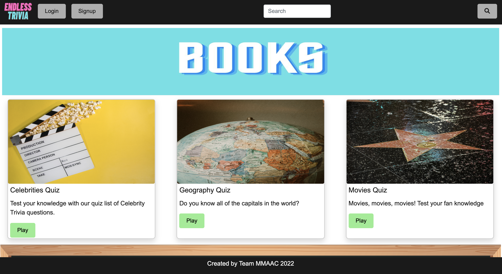
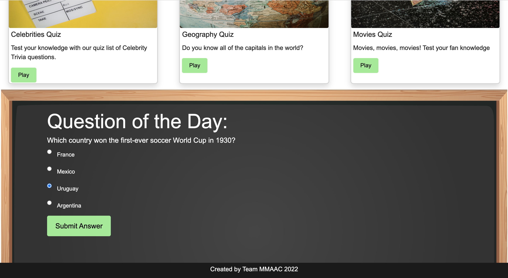
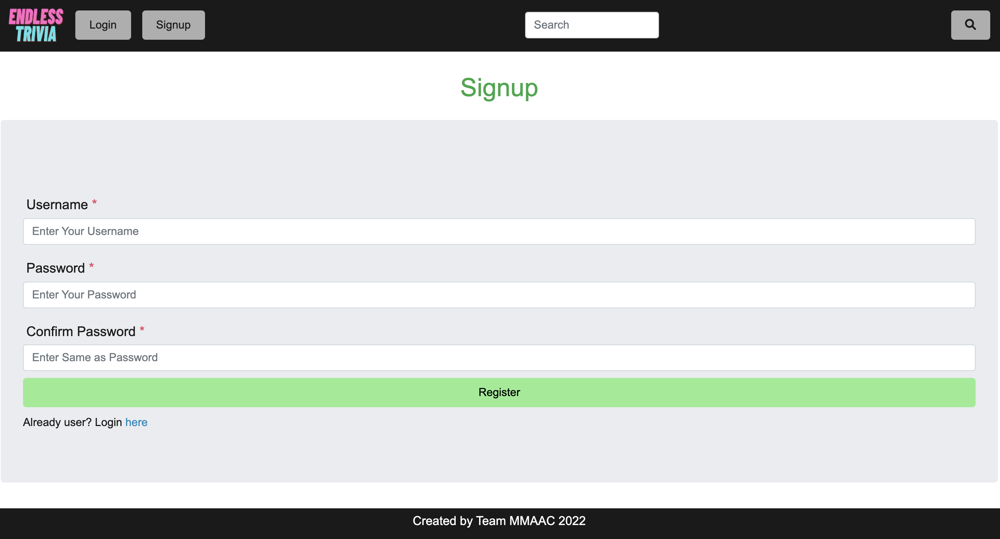
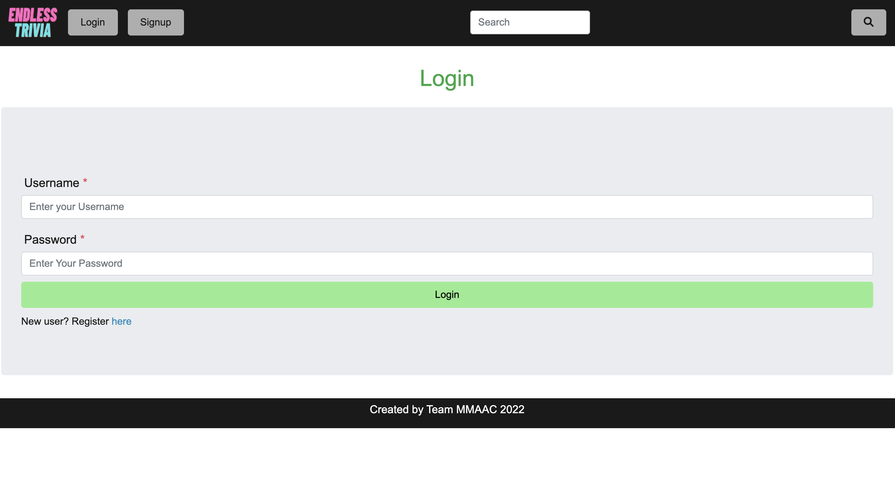
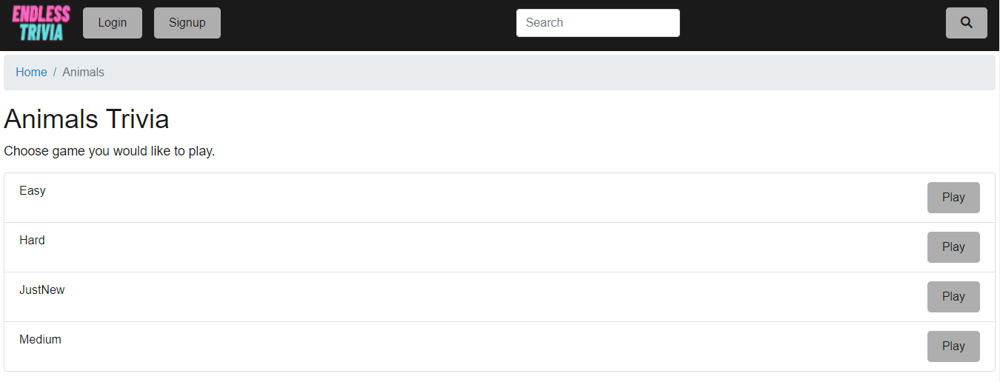
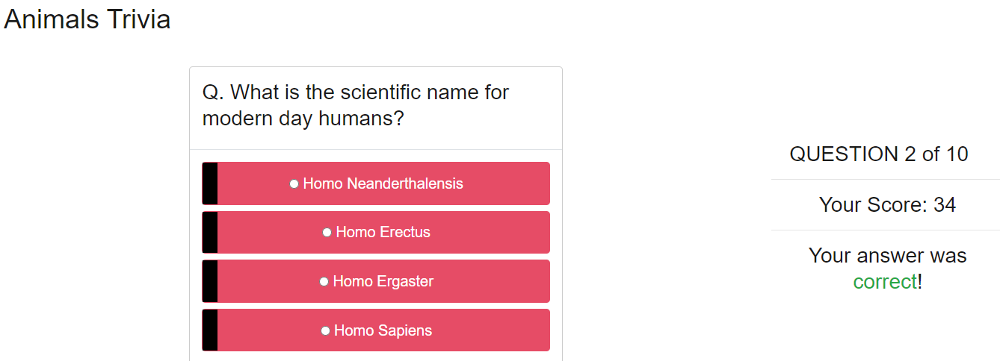
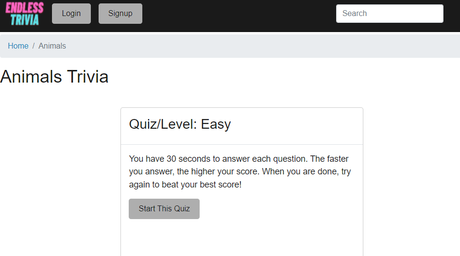

# Endless Trivia Application

  

  ## Description
  Endless Trivia is an application made for trivia enthusiasts who are looking for a challenge, students looking to study a specific topic and people who like to pass time with quizzes. 
  
  When visiting the site, users can sign up and login, reset their password, and view their history of previously played quizzes. Users can also participate in the Question of the Day, browse quizzes by category, and create their own quizzes!

  ## Project Requirements
  * Use Node.js and Express.js to create a RESTful API.
  * Use Handlebars.js as the template engine.
  * Use MySQL and the Sequelize ORM for the database.
  * Have both GET and POST routes for retrieving and adding new data.
  * Use at least one new library, package, or technology that we haven’t discussed.
  * Have a folder structure that meets the MVC paradigm.
  * Include authentication (express-session and cookies).
  * Protect API keys and sensitive information with environment variables.
  * Be deployed using Heroku (with data).
  * Have a polished UI.
  * Be responsive.
  * Be interactive (i.e., accept and respond to user input).
  * Meet good-quality coding standards (file structure, naming conventions, follows best practices for class/id naming conventions, indentation, quality comments, etc.).
  * Have a professional README (with unique name, description, technologies used, screenshot, and link to deployed application).

  ## Table of Contents
  1. [Description](#description)
  2. [Requirements](#project-requirements)
  3. [Technologies](#technologies) 
  4. [Screenshots](#screenshots)
  5. [Contributors](#contributors)

  ## Technologies
  * Node.js
  * Express.js
  * Handlebars.js
  * mySQL
  * sequelize
  * dotenv
  * bcrypt
  * [trivia-api](https://www.npmjs.com/package/trivia-api)  

  ## Screenshots
   
  
  
  
  
  
  

  ## Contributors
  * Aaron Losey
    * github: AJLosey
  * Anissa Williams
    * github: Anissawillams
  * Cody Claussen
    * github: Greenbear25
  * Mayur Patel
    * github: pmayur0680
  * Melissa Hookey
    * github: melissahookey